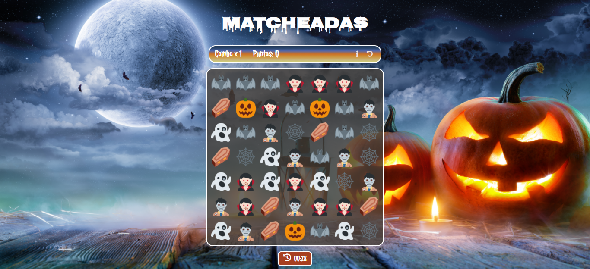
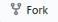
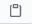

# **👻MatcheAdas por Silvina Bordon 🎃**  
Esta aplicación es un juego cuyo objetivo es lograr encontrar coincidencia de 3 o mas items iguales para acumular puntos en un periodo de tiempo determinado. Proyecto realizado como evaluacion final del modulo del curso de desarrollo FrontEnd Ada, utilizando HTML, CSS y JavaScript.


#### ⏩Si quieres JUGARLO puedes hacer click en este [enlace](https://silbordon.github.io/proyecto-matcheADAs/).


***


## **Instalación** 👈🏻

### Para clonar este repositorio tienes que seguir estos pasos:

<br>

 - Ir al [repositorio](https://github.com/Silbordon/proyecto-matcheADAs)  
 - Hacer click al botón de 
 - Hacer click al botón de 

 - Copiar la URL haciendo click al boton 
 - Abrir tu terminal y poner el comando de 
   ```
   git clone <url> 
   ```
 - Entrar a la carpeta del proyecto y abrirlo en tu IDE


<br>

 🔧 **Este proyecto requiere las siguientes dependencias**

<!-- <br> -->
📁 [SweetAlert](https://sweetalert.js.org/)


📁  [Twemoji](https://twemoji.twitter.com/)

<br>

***


## **Agradecimiento** 🥰😘

- Quiero agradecer a nuestro profe [Jonh](https://github.com/Jonhks) y a [Leydy](https://github.com/leydyk93) por su paciencia y ayuda constante para que podamos aprender, y a todas mis compañeras por el apoyo diario.

- A mi esposo por ser mi soporte todos los dias, recordandome que nunca es tarde para aprender cosas nuevas y por ayudarme a recorrer el maravilloso mundo de la programación.

#### *De Silvi con ❤*
